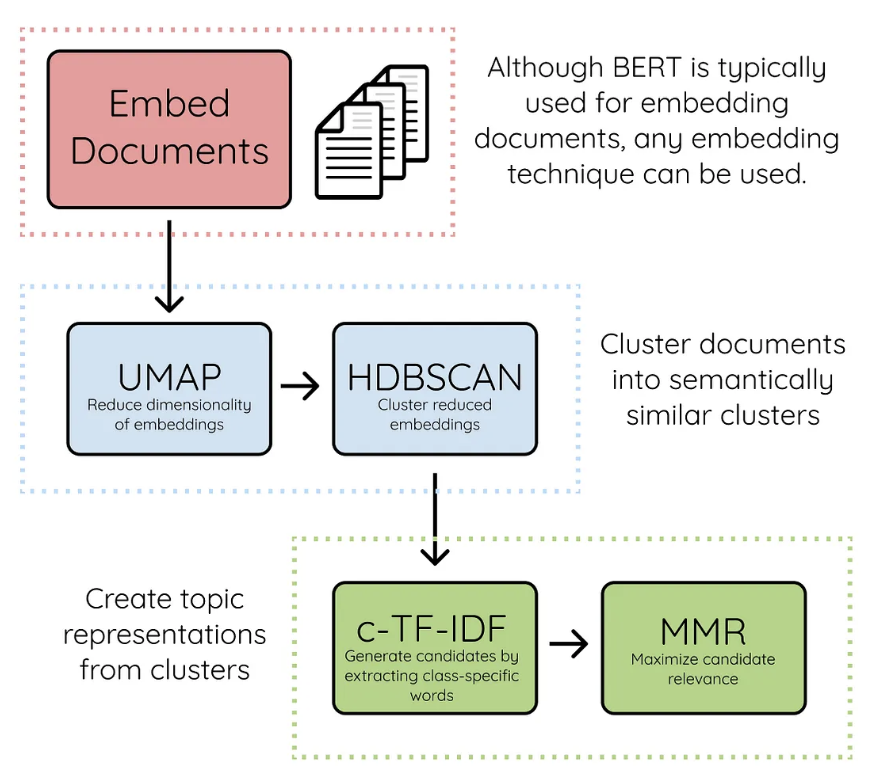
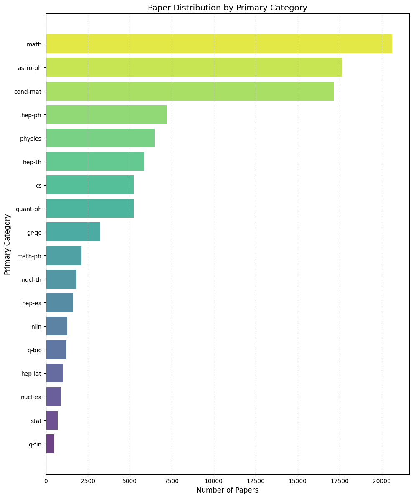
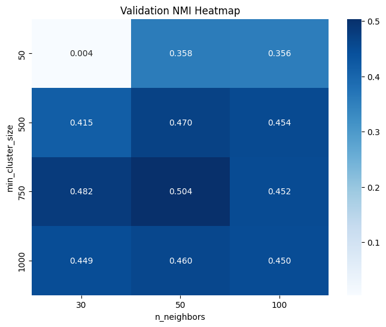
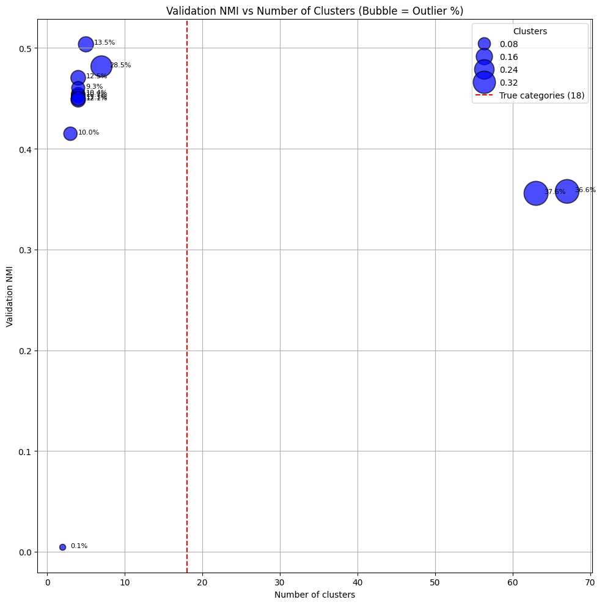
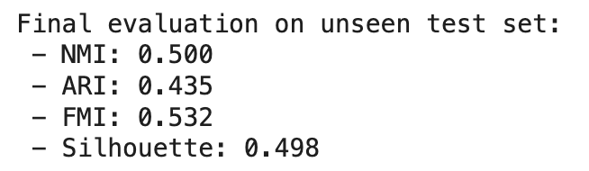
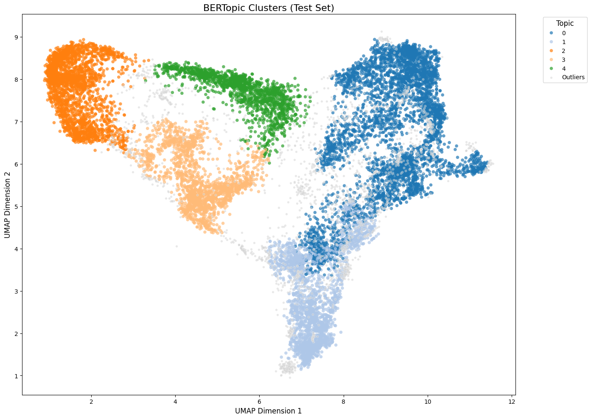
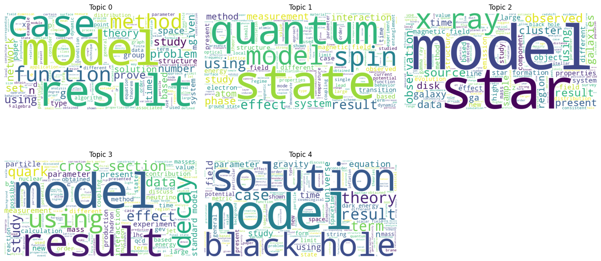

# Research Papers Clustering
In this project, BERTopic clustering is performed to find the optimal number of topic clusters in the arXiv dataset (https://www.kaggle.com/datasets/Cornell-University/arxiv).

_For the full implementation and to reproduce the analysis, please see the Jupyter notebook in this repository. Make sure to install requirements from the requirements.txt file to avoid any version incompatibilities. For simplicity of reproducing the results, the stages of the implementation which take the most time (namely, producing SBERT embeddings for the dataset and finding the optimal model via grid search) can be skipped by downloading the ready embedding and model files also present in this repo and loading them in Colab (cells for loading these inputs are already present in the notebook code). Please make sure you are connected to a GPU runtime if you plan to calculate the embeddings and perform grid search from scratch instead of downloading the files from the repo._ 

# Literature Review

Because the total number of categories is unknown, the task can be interpreted as an unsupervised classification (clustering) problem. Clustering aims to automatically organize a collection of documents into meaningful groups based on content similarity. Existing NLP approaches to clustering vary in computational complexity, performance and interpretability. They can broadly be separated into three categories (Zhu et al., 2025):

*   **Traditional Methods**
    

For example, the simpler TF-IDF + K-means clustering approach where sparse, high-dimensional lexical features are used to assign data points to a predefined number (k) of clusters.

*   **Embedding-based Methods**
    

More sophisticated dense embeddings produced with BERT or similar models are used to assign data points to clusters, typically in an unsupervised manner, e.g. via graph-based spectral clustering or (H)DBSCAN. 

*   **LLM-based Methods**
    

These approaches use instruction-tuned GenAI models as a guide for text clustering by generating labels directly from the data, which can subsequently be used for training a classifier.

Since we don't have a pre-defined number of categories in this task, the traditional, simpler methods like K-means clustering may not be useful. Though the optimal k can be found via the elbow method by plotting WCSS against different k values, K-means has other weaknesses as well, such as struggling with non-linear clusters, including clusters with varying densities or irregular shapes (Divya & Maniraj, 2025), which also makes it less suitable for this task with a complex, multidimensional dataset.

Graph-based methods such as Leiden algorithms and spectral clustering can be very performant in modeling complex text data like the arXiv database of research papers since they have superior ability to effectively model citation networks. Despite their efficiency, to achieve good performance extensive parameter tuning would be needed, and they can struggle handling large networks with uneven structures, such as research papers dataset containing loosely connected papers. (Huong & Koch, 2025)

As for LLM-based methods, they can be powerful but are more computationally costly to implement, requiring extensive GPU usage and often causing high latency than other approaches. Since we are working with a large dataset, the chosen method of analysis must be robust enough for processing millions of data points without excessive GPU needs. Additionally, token costs would be an important limitation of this method. (Kuligin et al., 2025)

In previous research, unsupervised clustering using BERTopic has yielded high performance (Zhu et al., 2025) while being efficient to implement for large, complex datasets. For instance, in Kaur & Wallace, 2024, 8 out of 12 evaluators preferred clusters from BERTopic over other clustering approaches in terms of informativeness, level of detail and coherence. Therefore, this approach was chosen for the research papers clustering implementation in this project. BERTopic will allow us to automatically discover topic structure in the research papers dataset in an unsupervised manner, while still enabling final evaluation against ground-truth categories present in the arXiv dataset using common clustering evaluation metrics like Adjusted Rand Index (ARI), Normalized Mutual Information (NMI) and Fowlkes–Mallows Index (FMI). (Shilpa et al., 2025)

# Methodology

BERTopic leverages SBERT embeddings of text data (in this analysis, produced using the model [all-MiniLM-L6-v2](https://huggingface.co/sentence-transformers/all-MiniLM-L6-v2) from Hugging Face), coupled with Uniform Manifold Approximation and Projection (UMAP) dimensionality reduction and Hierarchical Density-Based Spatial Clustering of Applications with Noise (HDBSCAN) algorithm to group complex datasets into explainable clusters. 

  
   
  <em>Source: bertopic.com</em>

What makes BERTopic more transparent than most other clustering approaches is the simplicity of interpreting results, as BERTopic allows to produce visual cluster representations (e.g. word clouds or bar charts) featuring the most frequent terms per cluster identified via the TF-IDF adapted to be calculated on per-cluster instead of per-corpus basis (c-TF-IDF).

The BERTopic implementation for this project included five key stages:

**1\. Exploratory Data Analysis (EDA)**

When loading the dataset, the first 100K data points were preserved only, to ensure fast execution of this demo. Only the abstract and categories were saved to a pandas df, to keep the dataframe focused on the main elements needed for the analysis. Additionally, the primary category associated with each article was extracted, which was the first category mentioned, without any subcategorization included (e.g. "math.CO cs.CG" became "math"). This helped reduce dataset dimensionality and ensure a cleaner ground truth to evaluate the model against later, as there were 6,072 categories present before this extraction and only 18 after in the 100,000 papers dataset.

The category distribution was found to be highly uneven (see figure "Paper Distribution by Primary Category" below), where the most common categories like math and astrophysics had tens of thousands papers, while the least common categories such as quantitative finance and statistics only had a few hundred papers present in the dataset. This finding supports the choice of BERTopic as a clustering approach over, for example, K-means which tends to struggle with imbalanced clusters and irregular distributions.

  

During dataset exploration, it was also found that the average abstract length was 121 words and the maximum was 457 words, showing the abstracts were suitable for generating SBERT embeddings without token limit issues. So, it was established that no abstract trimming would be necessary. At the same time, the shortest abstract length of 2 words pointed to the need for removing papers from the analysis that had uninformatively short abstracts, which was done in the following step - preprocessing.

**2\. Dataset Preprocessing**

As mentioned above, during preprocessing it was necessary to remove papers with overly short abstracts. The cutoff point for the acceptable minimum length was done via qualitative analysis of abstracts at lengths 0-10, 10-20 and 20-30 words. It was found that in the first two categories, many abstracts were invalid, e.g. they mentioned that the article was withdrawn due to various issues, such as copyright infringement. So, it was decided to keep only papers with 20+ word abstracts, which reduced the dataset to 98,611 entries, still with 18 primary categories present.

During preprocessing, duplicate removal was performed, as well, since arXiv has some cross-listings, which reduced the dataset further to 98,556 papers, again without changing the number of primary categories present.

The final preprocessing step was removing excessive whitespace, as well as any LaTeX equations and citations, which would potentially worsen the quality of SBERT embeddings. It was decided not to apply lowercasing, lemmatization or stopword removal, as SBERT embeddings are designed to capture semantic meaning from full sentence context. Such preprocessing steps, while beneficial for traditional approaches like bag-of-words or other sparse representations, can remove useful linguistic information and are therefore unnecessary in this context.

**3\. BERTopic Model Fitting with Hyperparameter Tuning**

At this stage, the dataset was split into train, test and validation subsets (70%, 15% and 15%) with stratification by primary category, following machine learning best practices. Then, embeddings for the dataset were calculated using [all-MiniLM-L6-v2](https://huggingface.co/sentence-transformers/all-MiniLM-L6-v2) sentence BERT model from Hugging Face. The embeddings were stored to avoid recalculation at every model fitting during hyperparameter search.

Then, grid search was performed to optimize two key hyperparameters contributing to clustering quality and granularity in BERTopic. The first hyperparameter was minimum cluster size - this regulates the lowest number of data points required per cluster, and this indirectly controls how many or few clusters would be produced. Values of 50, 500, 750, 1000 were tested. The second hyperparameter was the number of neighbors for the UMAP dimensionality reduction - this balances the local and global structure preservation in the embeddings, with low values making the embeddings more focused on the local structure and high values on global. Values of 30, 50, 100 were tested. 

Normalized Mutual Information (NMI) score was used as the primary evaluation metric when searching for the optimal hyperparameters because it allows to evaluate how well the found clusters align with known labels and it is less biased than other metrics to imbalanced classes. 

As a result of hyperparameter tuning, the model with min\_cluster\_size=750 and n\_neighbors=50 had the highest NMI (0.504). (See the NMI results for the grid search in the heatmap below)

  

The best performing model identified 5 clusters in the dataset, with a reasonable percentage of outliers (13.45%). 

As seen in the figure below, the BERTopic model was prone to producing either too few (<10) or too many (>60) clusters. While neither is ideal, the models with fewer clusters performed better in terms of NMI and tended to have fewer outliers, bringing us to the conclusion that the optimal number of clusters for the 100K slice of this arXiv dataset is <10.

  

**4\. Final Evaluation on the Holdout Set**

Cluster quality in the best BERTopic model was further evaluated on an unseen test dataset, with an extended set of evaluation metrics from Shilpa et al., 2025, namely Adjusted Rand Index (ARI), Normalized Mutual Information (NMI), and Fowlkes–Mallows Index (FMI). Additionally, the Silhouette score was calculated to evaluate how similar the data points are to their identified cluster vs others, though this metric is best suited for convex-shaped, similar-sized clusters and is less suitable for high-dimensional data like in this arXiv dataset. (Monshizadeh et al., 2022) 

  

 

As seen above, the results of final evaluation were satisfactory, showing reasonably good cohesion within clusters and separation between them, as well as a fair level of alignment with ground truth labels (primary categories). In the Limitations & Future Work ideas are proposed for further improvement of the model, such as using a more powerful SBERT model for embeddings calculation and cleaning the dataset more thoroughly (e.g. by removing words common to all research papers, such as "model", "result", "solution", "study", "theory" and others) to ensure more clear-cut, topic-specific clusters.

**5\. Visualising Clusters for Qualitative Analysis**

As a final step in the analysis, visualisations of clusters were produced to evaluate their sizes, distribution and density. A high-level look at the clusters shows that unlike K-means, BERTopic is able to identify clusters of varying sizes and irregular shapes in the dataset, opening up the potential for finding more subtle, complex themes in the corpus.

  

A deeper qualitative evaluation of the clusters via generating per-cluster word clouds (see below) revealed that overall, the model clustered papers pertaining to the same high-level subjects together (e.g. math, physics, astronomy). However, it seems the model did not assign separate clusters to sparsely represented categories in the dataset (such as quantitative finance and statistics) and potentially clustered them together as outliers. Further hyperparameter tuning would be needed to ensure greater granularity in the model's clustering approach.

  

# Results Discussion

As shown in the model results above, BERTopic turned out to be an efficient approach for finding semantic clusters that are not uniform in shape and density. The best-performing model successfully grouped together papers that share common themes, with reasonable degree of alignment between found clusters and primary categories in the arXiv dataset. 

Through extensive hyperparameter tuning using grid search, it was identified that fewer clusters (<10) that are larger in size (750+ data points) with moderate dimensionality reduction helped achieve optimal performance. Further performance improvements could be gained by, for example, using a more powerful model for embedding generation, which is discussed in more detail in the Limitations & Future Work section below. Nevertheless, in this analysis BERTopic has proven to be a robust method for finding salient themes in a complex, multidimensional dataset.

# Limitations & Future Work

While this analysis was successful and efficient at identifying the optimal number of meaningful topic clusters in the dataset, it also had a few limitations. First, due to computational resource restrictions, the analysis for this demo was performed on 100K data points from the dataset of over 2M research papers. The clusters count and contents will likely change if the analysis is reproduced on the full arXiv dataset.

Additionally, one important limitation of BERTopic is that it can demonstrate stochastic behaviors, making the results vary from one run to the next, due to usage of UMAP for dimensionality reduction, which can approach the task differently in each run. To prevent this unpredictability, a random seed was set when using UMAP so that the results are more reproducible. (Source: [BERTopic Best Practices](https://maartengr.github.io/BERTopic/getting_started/best_practices/best_practices.html#preventing-stochastic-behavior))

Another important limitation is that BERTopic performance is dependent on the model used for producing embeddings. In this analysis, [all-MiniLM-L6-v2](https://huggingface.co/sentence-transformers/all-MiniLM-L6-v2) - a robust SBERT model from Hugging Face with 22.7M parameters - was used due to resource constraints. However, as a rule of thumb in NLP projects, the larger the model, the more detailed and high-quality the embeddings. Therefore, experimenting with larger SBERT models for producing embeddings could improve clustering quality.

What could also improve clustering performance in future iterations is removing common words, such as \["model", "result", "solution", "study", "theory"\] from the dataset to force the clustering to be based on more rare, and therefore more salient lexical features in the dataset. This could be accomplished by calculating frequencies of lemmatized words in the whole dataset and cleaning out disproportionally frequent words (e.g. the top 1%).

Regarding further experimentation paths, it could be beneficial to also compare the BERTopic model against a baseline K-means or LDA model to be sure that we achieve better performance with BERTopic compared to more traditional clustering methods. 

Finally, another possible avenue for experimentation could be using BERTopic in supervised or semi-supervised mode, which would allow for the clusters to be guided by the known categories from the arXiv dataset. It could result in more aligned clustering, though this approach would impede BERTopic from surfacing novel themes in the large research papers dataset which were not already encoded in the categories.

# References

Divya, G., & Maniraj, V. (2025). _Exploring clustering techniques: Hierarchical vs. K-means in unsupervised learning_. _International Journal of Scientific Research & Engineering Trends, 11_(1), 775–777.

Huong, V. T., & Koch, T. (2025). Clustering scientific publications: Lessons learned through experiments with a real citation network. _ArXiv.org_. https://doi.org/10.48550/arXiv.2505.18180

Kaur, A., & Wallace, J. R. (2024, December 19). _Moving beyond LDA: A comparison of unsupervised topic modelling techniques for qualitative data analysis of online communities._ arXiv. https://arxiv.org/abs/2412.14486v1

Kuligin, L., Lammert, J., Heinkelein, F., Bressem, K., Boeker, M., & Tschochohei, M., UNSUPERVISED TEXT CLUSTERING WITH LARGE LANGUAGE MODELS. Available at SSRN: [https://ssrn.com/abstract=5865188](https://ssrn.com/abstract=5865188) or [http://dx.doi.org/10.2139/ssrn.5865188](https://dx.doi.org/10.2139/ssrn.5865188)

Monshizadeh, M., Khatri, V., Kantola, R., & Yan, Z. (2022-11-01). ["A deep density based and](https://doi.org/10.1016/j.jnca.2022.103513) [self-determining clustering approach to label unknown traffic"](https://doi.org/10.1016/j.jnca.2022.103513). _Journal of Network and Computer Applications_. **207** 103513. [doi](https://en.wikipedia.org/wiki/Doi_(identifier)):[10.1016/j.jnca.2022.103513](https://doi.org/10.1016/j.jnca.2022.103513). [ISSN](https://en.wikipedia.org/wiki/ISSN_(identifier)) [1084-8045](https://search.worldcat.org/issn/1084-8045)

Shilpa, S., Shailaja, K. P., Nischitha, S. G., Navya, V. H., & Kondoju, K. T. (2025). External Clustering Validation using ARI, NMI and FMI. _ITM Web of Conferences, 79_, 01004. https://doi.org/10.1051/itmconf/20257901004

Zhu, Y., Yang, L., Xu, K., Zhang, W., Song, Z., Wang, J., & Yu, P. S. (2025). LLM-MemCluster: Empowering Large Language Models with Dynamic Memory for Text Clustering. _ArXiv.org_. http://arxiv.org/abs/2511.15424

